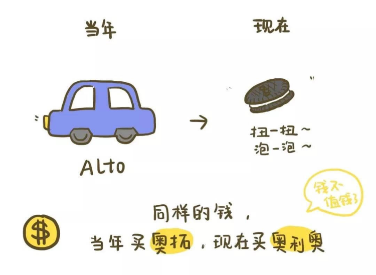
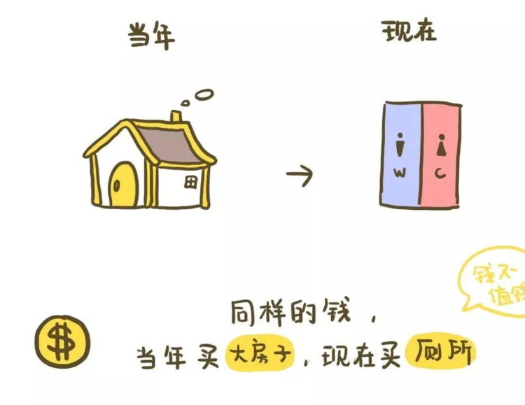
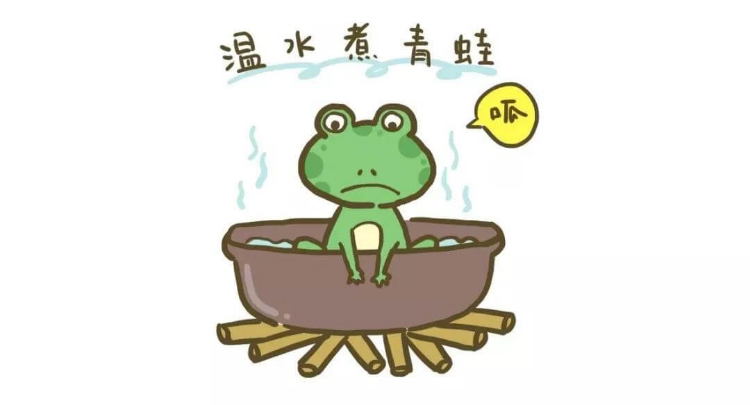
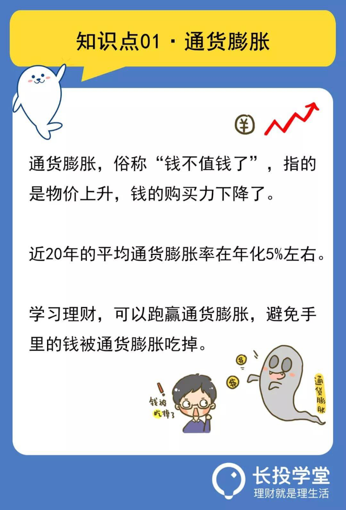
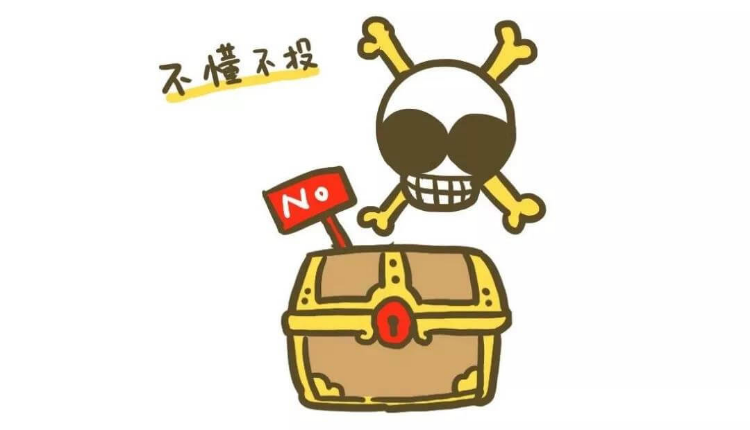
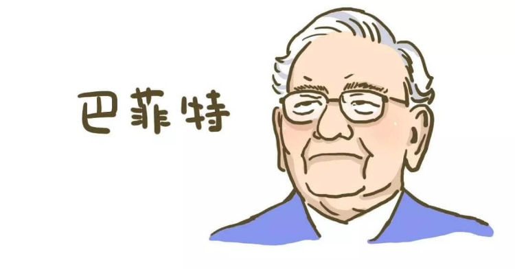
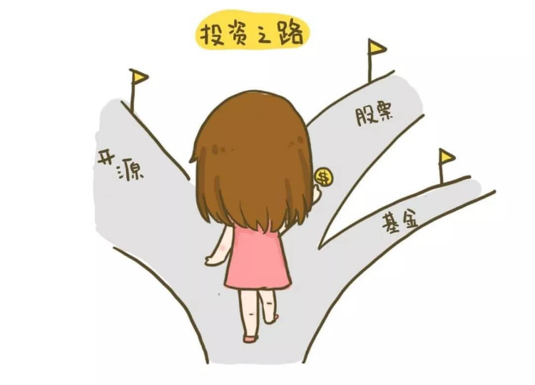

# 【第一课】都说钱不值钱了，我该怎么办？
理财就是理生活。欢迎来到长投学堂小白理财训练营。 
今天我们一起来学习第一课：都说钱不值钱了，我该怎么办？
> 这节课主要为大家解答两个问题：

> 第一，我为什么要理财

> 第二，理财有哪些误区

关于“钱不值钱了”这个话题，我们先从一个简单的东西说起：
相信很多小伙伴都吃过老冰棍吧？尤其是对于80后、90后来说，老冰棍绝对是儿时不可缺少的回忆了。如今不少厂家也在打这张怀旧牌，一块钱就能买一支老冰棍。

不过呢，大家肯定还记得，小时候吃的老冰棍，哪有一块钱那么贵啊？一般两毛钱就能买一支了。

要是我们会时空穿越，把一块钱送到小时候的自己手上，那他一次性就能买五支老冰棍了，走路都带风。
同样是一块钱，当年能买五支，现在只能买一支了。这就是很多人经常感慨的，钱不值钱了。

## 通货膨胀
“钱不值钱了”在经济学上有个专业名词，叫“通货膨胀”，指的就是物价持续的上升，虽然我们手里拿着同样的钱，但购买力会一年比一年低。
一样的钱，昨天能买奥迪，今天只能买奥拓，明天能买一包奥利奥就不错了。

关于通货膨胀，表现最明显的应该是房地产市场了。
我们经常听到身边发生这种事，张三他爸当年赚下一笔辛苦钱，原本买两套房不成问题，但就是攥着钱没舍得买，结果现在把钱拿出来，只够买个洗手间了。

这种人，就是吃了通货膨胀的大亏。

* “通货膨胀”通常对三类人很不友好：
* 第一类人，把钱压在枕头底下的人。

掏钱出来的时候里三层、外三层、扒开一层又一层。这类人是投资小白中的战斗小白，就连存进银行拿点利息都不去做。
自己的钱，放在家里多少年都不会涨，但是物价一直在涨，结果只能眼睁睁看着自己的钱被通货膨胀吃掉。

* 第二类人，把钱存进银行的人。

这类人的觉悟高一点，知道把钱存银行不仅有利息，而且还安全。
但是他们没计算过，银行的定期利息一般也就年化2%左右，而通货膨胀率是多少呢？近20年的平均通货膨胀率在5%左右。
这就好比一个人站在卡车上赛跑，人向前跑了两米，卡车往后倒了五米，感觉自己在前进，其实被卡车拖回去了。
把钱存进银行，还是跑不赢通货膨胀，还是要眼睁睁看着自己的钱被通货膨胀吃掉。
所谓的存进银行安全，其实根本不安全，温水煮青蛙，一点一点无形地蚕食掉你的财富。

* 第三类人，靠一份固定收入过日子的人。

这就是我们常说的死工资。年龄一直涨，工资却从来不见涨，要么就是像蜗牛爬树一样，一年只涨一丢丢。同样的工资，花起来就能感觉到，购买力一年比一年低。
还有一种情况，工资虽然涨了，但是涨的那点钱刚够买俩包子塞牙缝，涨幅根本跑不过通货膨胀。名义上是涨工资了，实际上日子过得紧巴巴，还不如从前。
如果有一天自己的工作被年轻人取代，仅有的这份收入也保不住了。

## 投资跑赢通货膨胀

既然通货膨胀这么可怕，那么我们要怎么打倒这只小怪兽呢？

有个很简单的办法，只要发挥逆向思维，避免上面三类人的做法就可以了，也就是说：不要把钱存在家里，也不要把钱全部存进银行，更不要依靠一份固定收入。

具体该如何操作，答案我们要学习的这两个字：**投资**。

投资可以帮我们打败通货膨胀。刚才我们说到，历年的平均通货膨胀率在5%左右，那么我们投资的收益率只要高于5%就可以了。
像余额宝这样的产品，收益率一般在3%左右，注定是跑不赢的。
而投资基金、股票，只要我们经过系统地学习，收益率超过5%几乎不成问题。
比如基金定投，长期坚持的话，收益率甚至可以高达到15%。
这就是投资的好处，不仅能够帮我们打败通货膨胀这只小怪兽，摆脱钱不值钱的焦虑，还能够增加我们的收入，让我们赚到更多的钱。
既然投资如此重要，那我们就从现在做起吧！世界上的投资对象千千万，代码连起来可以绕地球一圈，对于一个啥都不懂的投资小白来说，一上来先投资点什么好呢？

## 从投资自己开始

有句话叫做，不投资是等死，乱投资是找死。希望大家记住一条铁律，不懂的东西千万不要碰。

脑中无知识、冲在最前面，那叫莽夫，莽夫的后果往往就是炮灰。
到了投资这件事上，很多人就忘了这个简单的道理，他们还不会分析和估值，就匆匆买进了各种基金股票，最后基本都是赔钱的命。
不懂的不碰，先学习再操作，才是正确的投资姿势。不过呢，从今天开始，各位同学其实已经有了一个最值得投资的投资对象，那就是自己。
股神巴菲特有一个经典的“汽车”比喻：

“想象一下，如果你有一辆汽车，而且它是你这辈子唯一能拥有的汽车，那么你自然会对它倍加爱护，你会更经常地加油，更小心地驾驶，等等。”

“现在思考一下，你这辈子只有一个身体，一个大脑，你就会更爱护它们。你可以随着时间推移提高自己的思维水平。一个人最主要的资产，就是自己。”
所以说，我们要把自己当成投资对象，把学习的过程当做是一笔投资，慢慢实现自我的增值。这将是一笔最有价值的投资。
在接下来的课程中，我们将学习，钱生钱到底是怎么运作的，如何建立自己的收入体系，如何赚到更多的本金拿来投资，如何投资基金、股票等投资品。
总之，知识满满，值得期待。大家在开启投资之旅的第一站，先从投资自己开始吧！

## 敲黑板划重点

下面我们来总结一下这节课的知识点：
1、通货膨胀，就是物价持续的上升，钱不值钱了，钱的购买力下降了。通货膨胀对三类人很不友好，分别是，把钱放家里的人，把钱存银行的人，还有靠固定收入过日子的人。
2、投资可以帮我们跑赢通货膨胀，而且可以增加我们的收入。
3、不懂的千万不要碰，先学习再投资。
4、最有价值的投资是投资自己，让自我增值。
本节课的最后还有课后作业，记得点击下方【写作业】完成哦，完成后可获得【作业成就卡】，快去检验你的学习效果吧。
今天的内容就到这里啦。日拱一卒，积少成多，每天成长百分五，你也可以财务自由。我们下节课再见！

