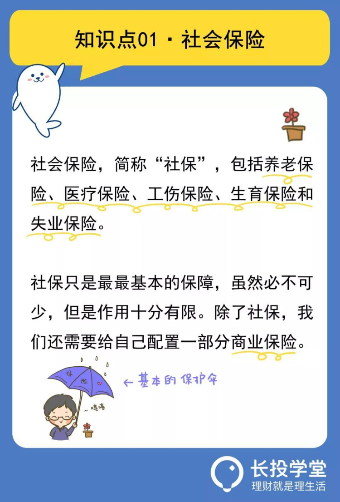
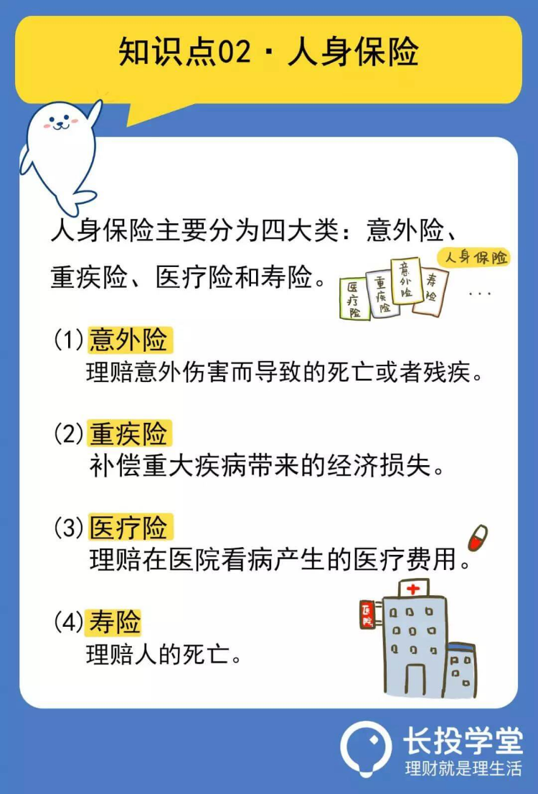
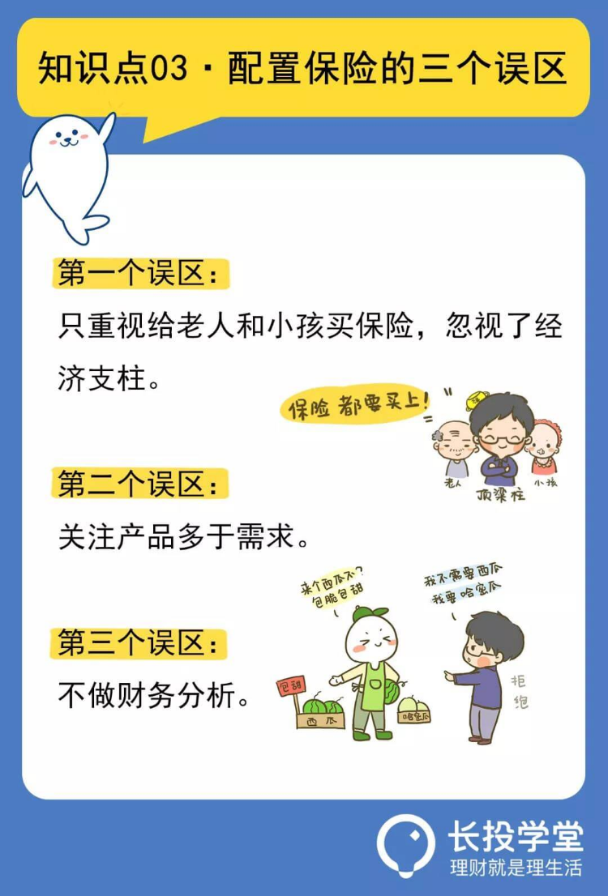

# 【第二课】钱难赚，保险别乱买
理财就是理生活。欢迎来到长投学堂小白理财训练营。

## 社保：有限的保障
今天，我们先来说一部曾经大火的电影，名字叫《我不是药神》。
里面的一个情节，一位老太太对着警察曹斌说：
“我病了三年，4万块一瓶的正版药，我吃了三年，房子被吃没了，家人被我吃垮了。谁家还没个病人，你能保证一辈子不生病吗？我不想死，我想活着。”

从这段话中，不仅仅是心痛老太太生病后家庭的拮据状况以及对生命的渴望，更多的扼腕叹息是她觉得自己已成为家庭子女的负担，却又无可奈何。
有人可能会好奇，我们不是基本上都有社保吗？药费报销就可以了，为何还会把生活吃得妻离子散，苦不堪言。
要回答这个问题啊，我们得先知道社保是什么。
社保，就是社会保险的简称。
绝大多数在企业工作的人，都会缴纳五险一金，单位给交一部分，个人再交一部分，这其中的“五险”呢，就是我们经常说的社保。

**“五险”分别是：养老保险、医疗保险、工伤保险、生育保险和失业保险。**

尤其是其中的养老保险和医疗保险，是我们接触频率非常高的。
因为不管是什么人，最需要受到保障的也就是：老有所养，病有所医。
养老保险是对老的保障，医疗保险是对病的保障。
所以啊，很多人就觉得，既然社保就能给我保障，那直接躺赢就可以了。
如果这样想就太天真了。
电影里这个天价药名叫格列宁，现实中叫做格列卫，是很久以后才被纳入医保的。
到目前为止，很多治疗重大疾病的特效药、副作用小的进口药，医保依然是不能报销的。

所以说，__医疗保险能发挥的作用十分有限__。
那养老保险呢，其实作用也十分有限，如果经过N年的通货膨胀，要靠养老保险保证我们的生活水平有一定的难度。
社保的原理就是要覆盖尽可能多的人，要覆盖这么多人，那么保障程度必然不高，否则谁也承担不了这个巨额的成本。
所以我们要及早认识到，社保只是最最基本的保障，虽然必不可少，但是作用十分有限。除了社保，我们还需要给自己配置一部分商业保险。

## 商业保险：补充社保不足

说起商业保险呢，不少小伙伴对它的印象其实不太好。
一个原因是，在八九十年代，保险行业刚刚在国内兴起，有些不负责任的保险推销员，为了销售额不择手段，总是把自家的保险产品说得天花乱坠。

结果当事故发生时，当初的许诺却得不到兑现，这就会导致大家一听说某个人是卖保险的，天然地就有点抵触，久而久之就觉得商业保险不太可信了。
还有个原因是，商业保险的保单上啊，一条一条的规定写得非常细，非常杂。等到真的出事以后，就变成了这也不能保，那也不能保。
其实，这些都是行业乱象导致的，并不是商业保险本身的错。
只要我们学会配置商业保险，就可以轻松避开这些买保险的雷区了。
商业保险主要包括两大类：人身保险和财产保险。
人身保险呢，保的就是人的生命或身体，财产保险呢，保的是财产及相关的利益。
今天我们就主要讲讲，与大家生活更密切的人身保险。

**人身保险主要分为四大类：意外险、重疾险、医疗险和寿险。其中，重疾险和医疗险同属于健康险**。

意外险，顾名思义就是保障意外伤害而导致的死亡或者残疾。注意啊，是意外伤害，如果是生病导致的死亡或者残疾，那意外险是一分钱都不赔的。
意外伤害有严格的定义，必须是外来的、突发的、非本意的以及非疾病的，这四个条件有一个不符合，那都是不赔的。
重疾险，补偿重大疾病带来的经济损失。一般来说，当确诊疾病并符合保险条款时，保险公司就会直接赔付保额。
不过呢，重疾险只保障重疾，如果生的是其它病，重疾险就派不上用场了。这个时候，我们需要医疗险啦。
医疗险，理赔的是医疗费用，只要是符合赔付标准的，都可以按照保险条款进行报销。
医疗险与重疾险最大的区别是，医疗险是报销型的，花多少报多少，报销的费用不会超过实际花销。重疾险是直接赔付性的。
最后一个是寿险，理赔的是人的死亡。不管是什么原因导致死亡，只要人死了就理赔。

不过自杀的情况有些例外，为了避免有些人想不开了用自杀骗保呢，一般是买寿险两年后的自杀行为才会理赔。
在这里提醒小伙伴们记住一句话，保险的作用不是降低风险，而是转移风险，避免意外发生后给家人造成巨大的经济损失。
比如老王买了重疾险，这并不能降低老王生病的风险，但是有了这份保险，一旦老王患了重疾，就不用担心为了治病而倾家荡产了。

## 避开保险的误区

在本节课最后，我们来谈谈配置商业保险的三个误区：
第一个误区：关注老人孩子多于经济支柱。

一个家庭中，谁是最应该配置保险的人呢？那我们就要看，谁如果不在了，会使整个家庭的损失最大。
这里说的损失不是情感上的损失，而是经济上的损失。因为我们刚才说过，保险的作用是转移风险，避免意外发生后给家人造成巨大的经济损失。
从这个角度考虑的话，一个家庭的经济支柱不在了，对整个家庭的经济状况影响最大，严重的话，甚至会影响整个家庭的日常开支。
所以，最应该配置保险的，是一个家庭的经济支柱，而不是老人和小孩。先把大人的保险配置充足了，再考虑孩子和老人的保险。
第二个误区：关注产品多于需求。

许多朋友在做保险规划的时候，首先考虑的就是买哪个保险产品，别人说啥好就觉得啥好，市面上什么保险产品火就也跟风去买……这些，其实都是不对的。
我们买保险，买的就是保障。应该首先根据家庭的负债情况、未来对家庭孩子的教育支出、家庭必须的生活费的支出，来量化家庭支柱各自承担的责任，以选择最适合家庭的保险产品。
现在很多家庭都会买刚需房，一般负债都是几十万甚至上百万，但是给家庭支柱的保单却只有10-20万，这样是达不到我们买保险的目的的，一旦真的出了什么事，这点保额根本不能给家人提供足够的保障。
第三个误区：不做财务分析。
保险到底怎么买呢，这时候，我们可能需要理财师了，他们给我们一份更精准的分析。
在分析之前，我们需要告诉他们你真实的财务状况。
很多小伙伴会想，收入是个人的隐私，不应该随便告诉别人，特别是那些涉世未深、收入还不高的小伙伴们，更是羞于剖析自己的家庭财务状况。
但如果不提供这些，他们又如何根据了解你的需求，进行个性化保险规划呢？
这就像我们去医院看病，医生肯定是了解你的病症以后，才可以对症下药~
所以，当需要理财师的精准分析时，大胆告诉他们你的家庭负债、日常必须支出是多少，有多少流动资产，夫妻双方收入如何等各项财务方面的问题吧。

## 敲黑板划重点啦

下面我们来简单总结一下：

* 第一，五险一金中的“五险”就是我们常说的社保，其中包括：养老保险、医疗保险、工伤保险、生育保险和失业保险。

* 第二，社保只是最最基本的保障，除此之外，我们还需要给自己配置一部分商业保险。商业保险分两大险种：人身保险和财产保险。

* 第三，保险不能降低风险，但可以转移风险，降低意外发生后带来的经济损失。

* 第四，保险配置应该优先考虑家庭经济支柱。

* 第五，买保险，要优先考虑需求，看自己需要哪些保障，再来挑选合适的产品。

* 第六，买保险，财务分析不能少，按实际说出自己的财务状况，专业人士才能给你精准的保险配置建议。
最后还要提醒一下小伙伴们，保险相关的知识还有很多。

比如，你知道每一种保险的保费都是怎么交的吗？你知道给自己配置多少保额合适吗？你知道怎么看保险条款吗？你知道怎么辨别一款保险产品的好坏吗？
所以打算花钱为自己或者家人购置一份保险的同学，还需要进行深一步的学习，掌握更多实用的保险知识。
本节课的最后还有课后作业，记得点击下方【写作业】完成哦，完成后可获得【作业成就卡】，快去检验你的学习效果吧。

日拱一卒，积少成多，每天成长百分五，你也可以财务自由，我们下节课再见。

