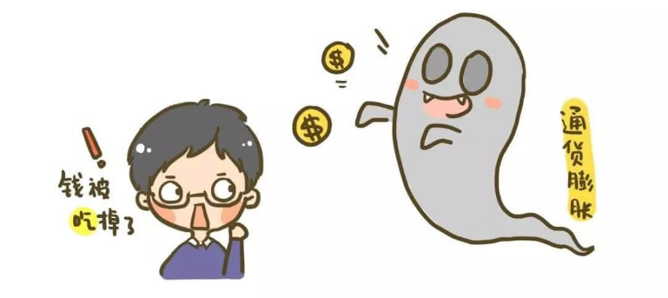
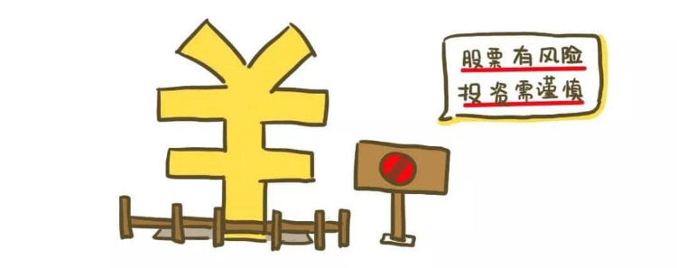
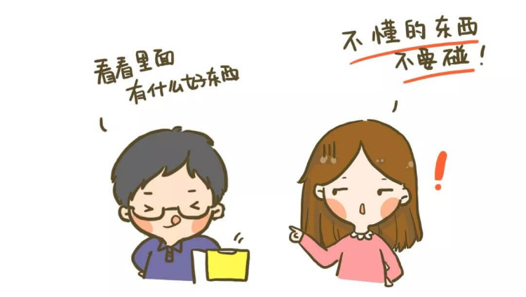
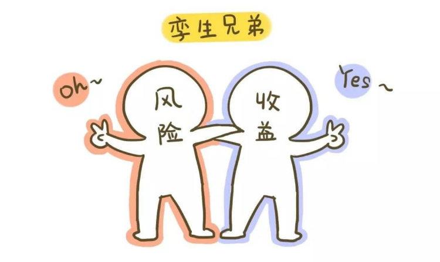
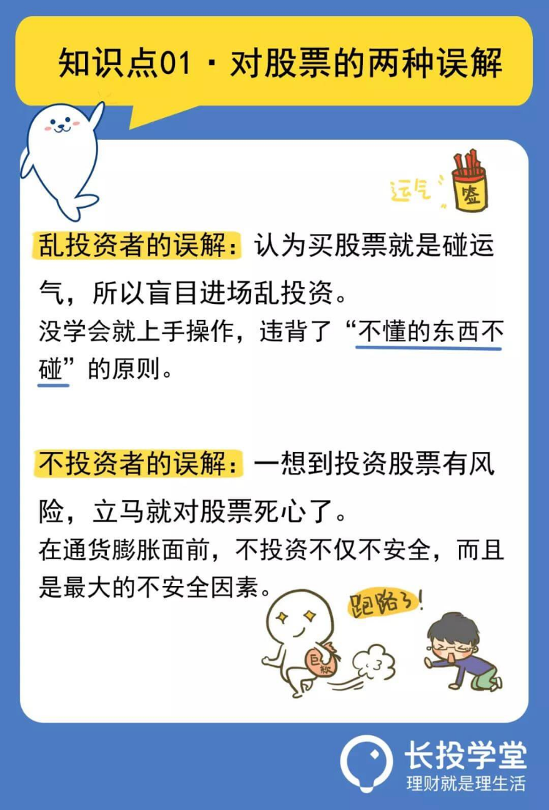
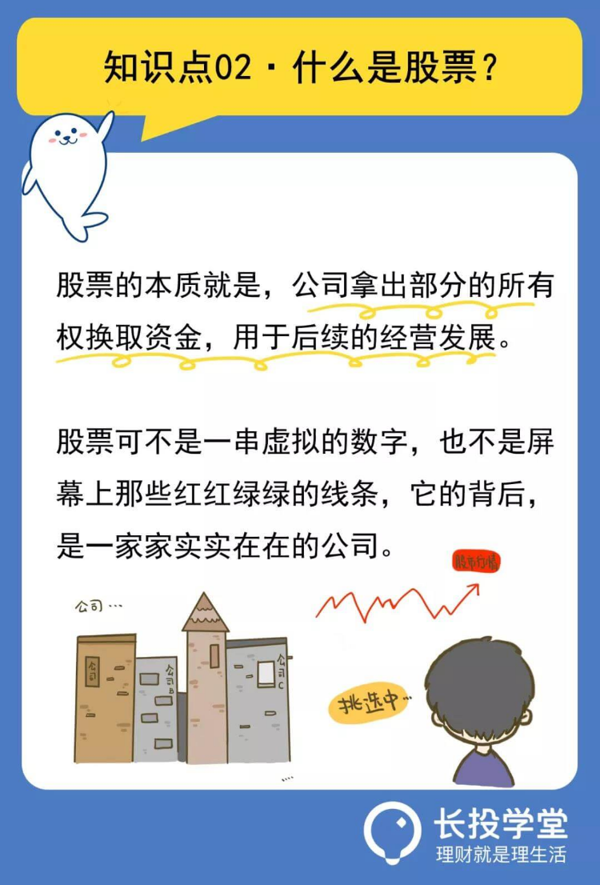
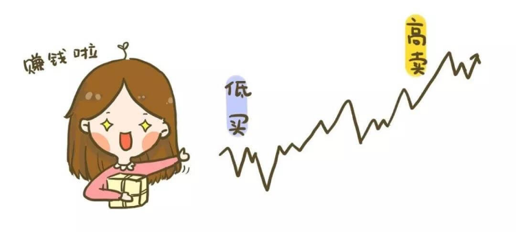
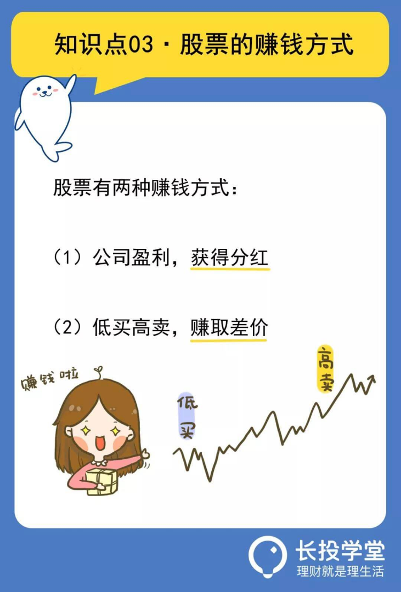

# 【第三课】股票，多数人的找死，少数人的等死
理财就是理生活。欢迎来到长投学堂小白理财训练营。

首先我们一起来回忆一下之前讲过的一个概念，通货膨胀。

    
我们已经知道，把钱放家里、存银行或者拿死工资都是跑不赢通货膨胀的。怎么样才能避免自己的钱被通货膨胀吃掉呢，答案就是投资。
说起投资，就有一个大众始终绕不开、逃不掉的话题——股票。
     
## 对股票的错误认识
     
   
有不少人会觉得，买股票就跟买彩票差不多吧，涨涨跌跌，那都是碰运气的事情。红红绿绿，只要不是色盲就能玩儿。
也正因为如此，虽然有很多人在炒股，但感觉上都是赔钱的多，赚钱的少。
另外，大家可能都听过一句话：股市有风险，投资需谨慎。

    
一谈到风险，好多人就开始畏首畏尾了，希望自己的钱越安全越好，买股票这种带风险的投资呢，干脆就不要碰了，不然赔了钱，心里肯定承受不了。
要么满心想着做那种保证不赔钱的投资，最好还能轻松一点不费脑子，可能吗。
这是两种很常见的错误想法，解释起来也很简单：
股市上赔钱的多，赚钱的少，这是没错的，但买股票可不是碰运气那么Low。
之所以这么多人赔钱，是因为这些人陷入了投资误区：没学会就上手操作，心急还想吃热豆腐。    
    
这些人除了一门心思想赚钱，根本没有系统学习过股票知识，也不懂股票赚钱背后的逻辑。
别人说买哪一只好，他们就买什么，看到股票价格跌下去，小心脏受不了，吓得赶紧抛出去，结果自然赔钱啦。
等股票价格涨上来，又一窝蜂跟着买，结果就是追涨杀跌，成了被股市收割的韭菜。
这么多人赔钱，不是因为他们运气差，而是因为他们没有系统地学习。重要的事情再说一遍，不懂的东西先不要碰，一定要先学习再投资。  

  
    
第二种错误想法呢，来自那些风险厌恶的人。一想到投资股票有风险，立马就对股票死心了。
他们认为投资是越安全越好，最好在不承担风险的情况下就能把钱挣到手。
我们反思一下，如果天底下有这种好事，那谁不想干啊，只要是地球人，应该早就集体实现财富自由了。
风险和收益永远是一对孪生兄弟，一般而言，投资对象的风险越高，收益也越高。

    
反过来说也是一样的，一个人的收益越高，那他承担的风险也就越大。
我们投资赚的钱，其实是对我们承担风险的一种补偿。    
有人说，那就干脆不投资，不买股票，不承担风险，我的钱不就安全了吗？
大家都学过了通货膨胀，如果不投资，或者只投资类似余额宝这种低风险甚至无风险的东西，赚的钱十分有限，肯定会被通货膨胀慢慢吃掉。
在通货膨胀面前，不投资不仅不安全，而且是最大的不安全因素。    
总结一下刚才这两种错误想法，前一种属于乱投资，后一种属于不投资。乱投资是找死，不投资呢，是等死。

    
    
接下来我们就来了解一下，股票这个东西到底是什么，投资股票赚的是哪门子钱。
     
## 股票到底是什么
     
   
我们把隔壁老王搬出来，举一个通俗的例子：
老王最近想自主创业，开一家餐馆。我们就比如这家餐馆是沙县小吃吧。
老王仔细算了一下，开一家沙县小吃需要10万块钱，但是呢，他撑破天只能拿出8万，剩下的2万呢，他准备去找隔壁翠花要。
老王跟翠花这么说：
翠花啊，你别慌，我这次来不是找你借钱的，而是要跟你一起开这家沙县小吃。我出8万，你出2万就行了。
    
你不用来店里上班，但是呢，你得承担我开店的风险。
如果我这家店赚钱了呢，我们就把赚的钱分了，我分八成，你分两成；如果我这家店赔了呢，你就得跟我一起承担这个损失，我承担八成，你承担两成。
翠花想了想，老王这个人平时办事稳妥，还是让人信得过的，所以就投了2万块钱。老王的沙县小吃店也就正式营业了。
    
这个例子就是股票投资的雏形。
翠花投资了2万块钱，相当于持有这家店20%的股份，她对沙县小吃店是有所有权的。
老王呢，就是出让了这家店一部分的所有权，从而换来了资金。
股票的本质就是，公司拿出部分的所有权换取资金，用于后续的经营发展。    
如果你买了蒙牛的股票，就相当于你出钱换了蒙牛的一点所有权，蒙牛只要赚钱，就得分你一点。
    
如果你买了阿里巴巴的股票，就相当于你出钱换了阿里巴巴的一点所有权，阿里巴巴只要赚钱，就得分你一点。
这些公司分给你的钱呢，就叫做分红。    
所以说，股票可不是一串虚拟的数字，也不是屏幕上那些红红绿绿的线条，它的背后，是一家家实实在在的公司。    
    
接下来，我们再来说说，投资股票赚的是哪门子钱。

     
## 投资股票的赚钱方式
     
   
刚才我们已经说了一种赚钱方式，那就是公司分红。    
公司越赚钱，大家分的越多。这个赚钱方式在股票刚出现的时候就有了。
股票发展到后来呢，又出现了一种新的赚钱方式，那就是低买高卖，赚取差价。    
我们还是拿老王和翠花来举例子：
老王和翠花的沙县小吃店越做越红火，很多人看着眼红，都想入股。
附近有个富婆叫马兰花，主动上门来找翠花，她说：翠花啊，我想花20万买你手里的股份，你看行不行？
翠花算了一下，他手里的这些股份，买的时候是2万块钱，现在卖20万块钱，翻了十倍呐，于是她决定同意马兰花，卖掉手里的股份。
这个例子中，翠花做的其实就是低买高卖，赚取差价。

    
有同学就会说了：“道理我都懂，那到底怎么样才能拿到分红，怎么样才能低买高卖呢？地球上有那么多公司，我怎么知道买哪家公司的股票才能赚钱呢？”
    
嗯……这是一个值得深思的问题。单单中国股市，就有成千只股票。为什么你要执着只选一支股票呢？
股票你可以一次性选四五六七八支，甚至二十支，万一其中一个出了意外翻了，没关系，其他的都还好好的，毕竟收益才是我们的关注点。
如何才能从上千支股票选出能够赚钱的股票？如何用科学的策略赚安稳的钱？如果你想要进一步学习，可以继续学习“股票初级训练营”。
“股票初级训练营”是由长投学堂内容团队精心打造，已经帮助超90万学员顺利毕业，完成了从0基础到系统掌握A股投资的蜕变。
在训练营里，你将学会股市估值、分散风险，掌握股票投资策略，构建自己的最优组合。同时，在班主任团队的带领下，制定最适合自己的股票投资方案。
也就是说，从股票初级训练营毕业以后，就可以亲自上手操作，玩转股票投资了，如果你对课程感兴趣，戳文末的课程推荐进行试听哦。
     
## 敲黑板划重点啦
     
   
好了，以上就是今天的全部内容了，我们来总结一下今天的知识点：

* 1，乱投资是找死，不投资是等死。在通货膨胀面前，不投资不仅不安全，而且是最大的不安全因素。
* 2，股票的本质就是，公司拿出部分的所有权换取资金，用于后续的经营发展。
* 3，股票赚钱有两种方式，一种是公司分红，另一种是低买高卖。

    
本节课的最后还有课后作业，记得点击下方【写作业】完成哦，完成后可获得【作业成就卡】，快去检验你的学习效果吧。    

今天的内容就到这里啦。日拱一卒，积少成多，每天成长百分五，你也可以财务自由，我们下节课再见。
