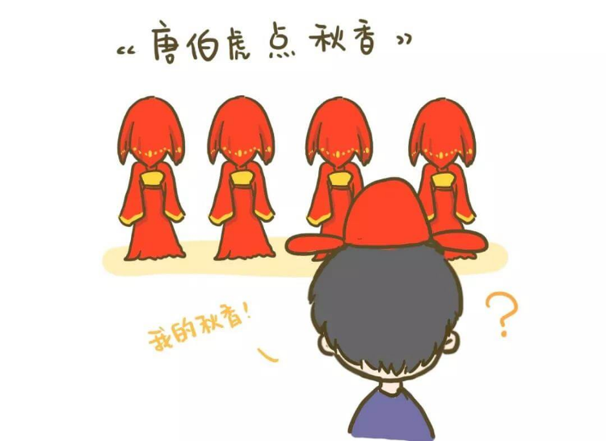
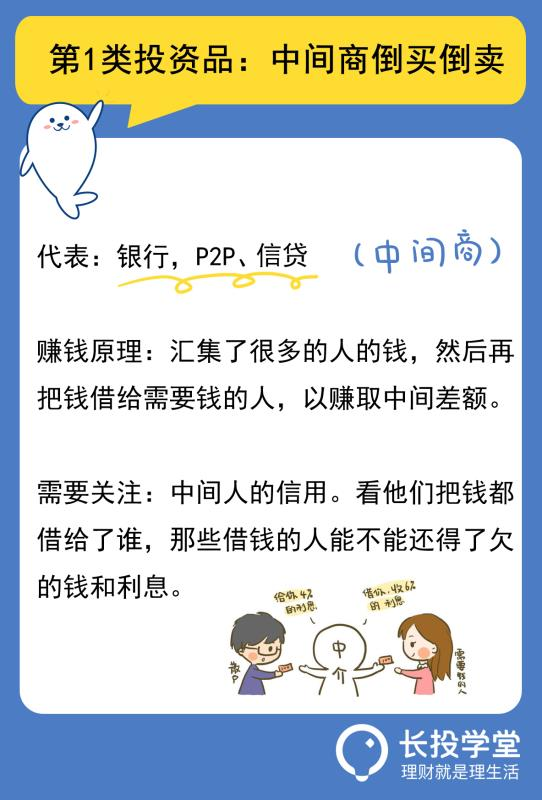
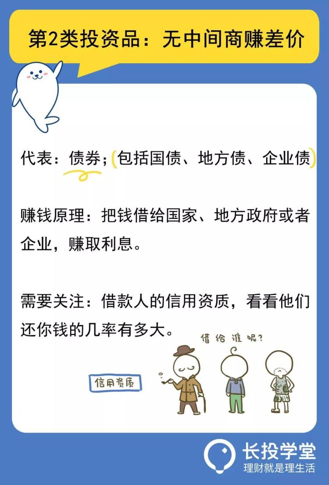
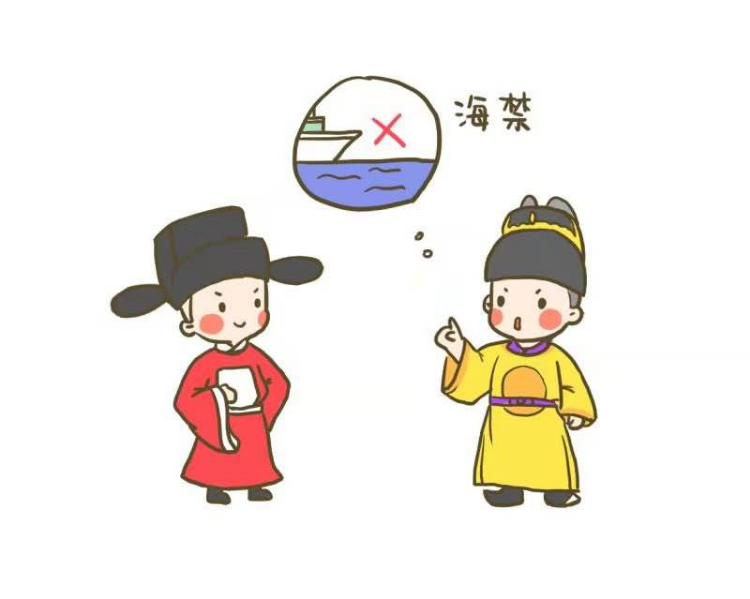
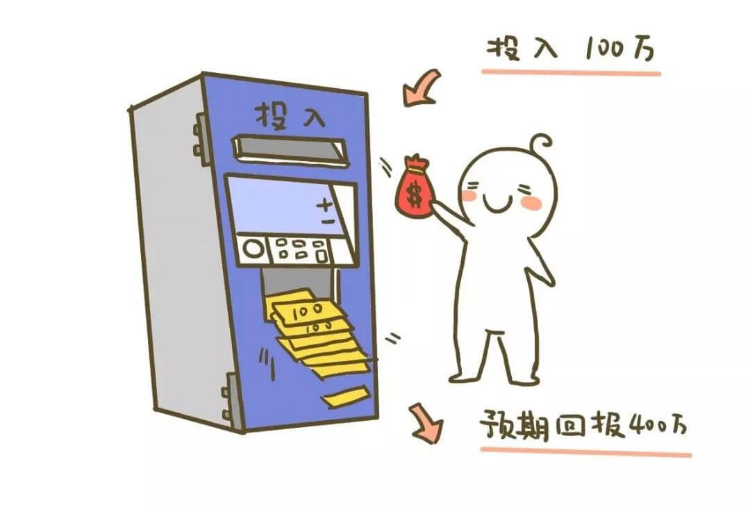
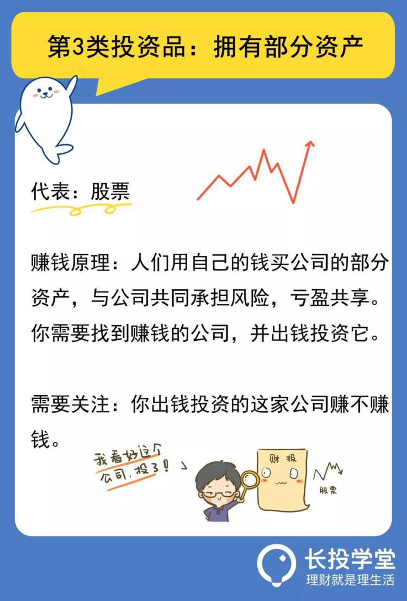
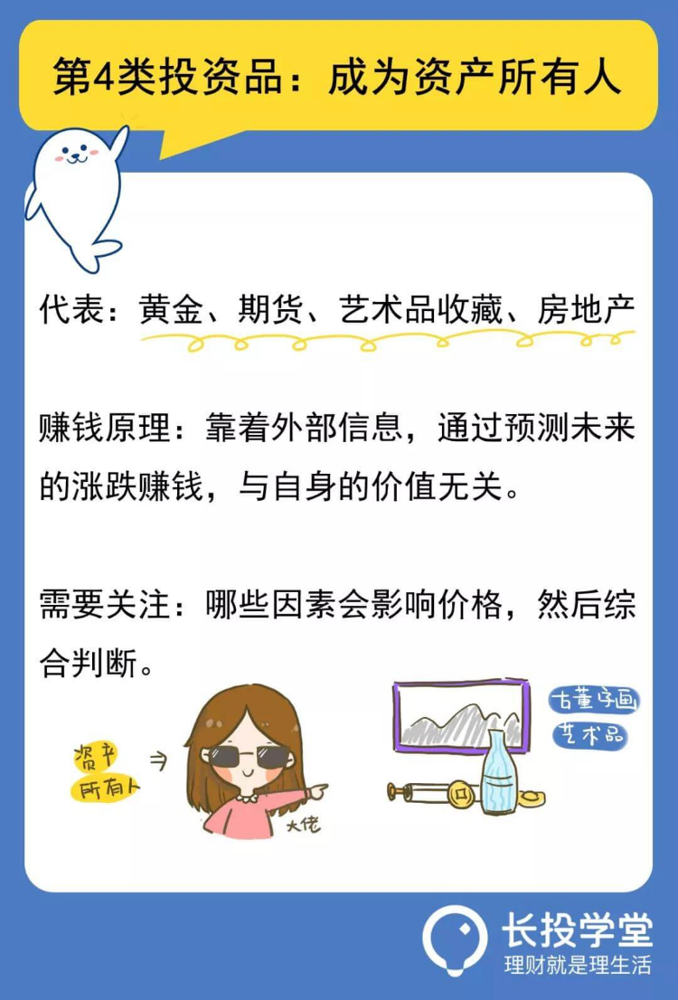
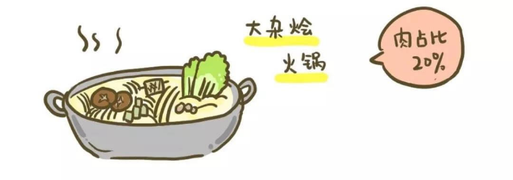
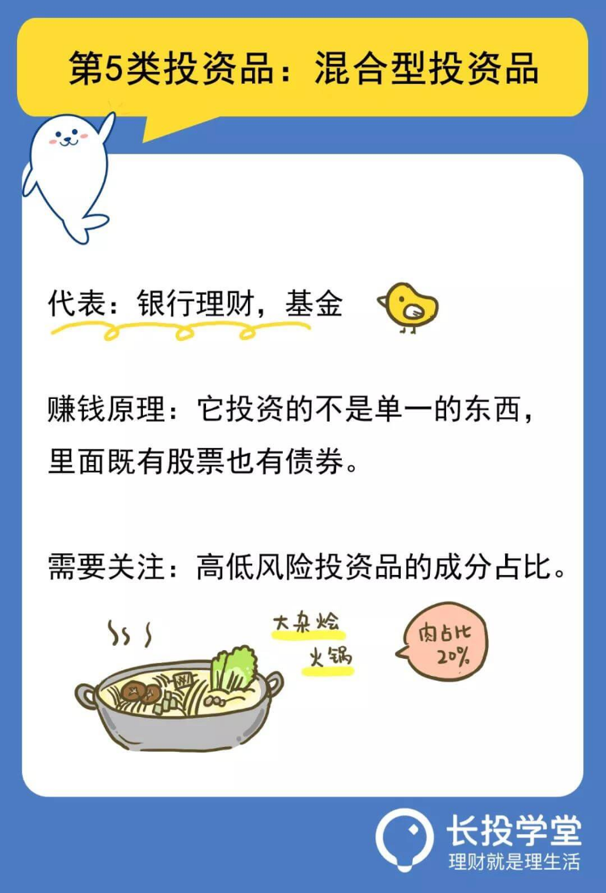

# 【第四课】让人眼花缭乱的投资品，其实就五类
理财就是理生活。欢迎来到长投学堂小白理财训练营。

相信大家都听过“唐伯虎点秋香”的故事吧，在华府招亲的时候，十几个女人蒙着盖头站在一起，唐伯虎也不知道哪个盖头下面才是真正的秋香。

    
我们在选择投资品的时候，跟“唐伯虎点秋香”的处境其实差不多，面对着让人眼花缭乱的投资品，感觉个个都能赚钱，傻傻分不清楚，不同投资品之间的区别到底在哪里。
不过呢，唐伯虎有他点秋香的办法，我们也有选择投资品的办法。秋香，冬香，十三香，她们的特征是不一样的。各种投资品也是一样，任投资品千姿百态，也逃脱不了下面这五种类型。
     
## 第一类，叫做中间商倒买倒卖
     
   
这类投资品的代表是：银行，P2P、信贷等等。其中，银行储蓄是最典型的。
    
你把钱存到银行里，会有利息产生，你想过这利息是从哪里来的吗？
告诉你一个真相：定期存款3年3%，而贷款利率高达年化6%，中间这个利息差，就归银行赚走了。
银行、民间高利贷、小额信贷公司，赚钱的原理都是类似的。这种方式是：汇集了很多的人的钱，然后再把钱借给需要钱的人，以赚取中间差额。

    
银行一般都借给有固定资产抵押的大型企业，还不出来的人相对较少，风险相对较低。
而民间高利贷和小额信贷，是借给那些着急用钱、并承诺给高额回报的个人或公司。
由于借钱人质素良莠不齐，借贷手续简单，无法充分保证收回资金，风险相对较高。
所以第一类的投资品，你要关注中间人的信用。    
他们把钱都借给了谁，那些借钱的人能不能还得了欠的钱和利息？而不能只把目光放在收益上面。  

  
    
     
## 第二类，叫做无中间商赚差价
     
   
这类投资品的代表是：债券。包括国债、地方债、企业债。
    
“债”字的前面是借钱的一方。
国债是国家向你借钱，地方债是地方政府向你借钱，企业债是企业向你借钱。买卖双方直接达成交易，无中间商赚差价。
政府的信用是良好的，所以国债几乎被认为无风险，除非国家被攻占了，还不出钱的几率很小。
但是，地方政府的信用却参差不齐，部分地方债的风险就比较高，风险比企业债还高。
企业债就要看企业家的信用了。
假设有A、B两个企业家，同样是开饭店，他们这个月都来向你借钱。

    
分析一下：
A老板是远近出名的厨师，生意也很红火，他想借点钱扩大店面规模。
B老板是开麻辣烫店，上个月因为原材料不新鲜被客户投诉了，他想借点钱开第二家店。
我们可以判断出，A老板是被业务推动着前进的，因此还款能力大概率比B老板好，相比于B老板，借给A老板是比较保险的。

所以第二类的投资，主要是看借款人的信用资质，看看还钱的几率有多大。    

    
     
## 第三类，叫做拥有部分资产
     
   
这类投资品的代表是：股票。
大航海时代，也就是15世纪末16世纪初，当时我国正处于明朝时期。开国皇帝朱元璋在明朝刚建立不久，就实行了海禁政策。

    
他认为发展农业才是正确的，对外朝贡贸易可有可无。
其实正因为商品经济被压制了，我们的国家在那时就已经埋下了落后的病根，悄无声息地被西方列强赶超了。
在西方，欧洲人已经开始了海上远洋活动，并形成了多条贸易路线，大大增加了各大洲之间的沟通。
商人出海贸易要有船，造船需要一大笔钱，而且指不定遇上海盗，风险极高。
有个人想到一个主意：众筹！大家一起出钱造船，之后出海贸易赚了钱，按出钱的比例来分成。
风险是，如果没赚钱或者赔了，出资人就没得赚了，甚至钱会打水漂。
于是，世界上第一个股份制公司——荷兰东印度公司，诞生了。
最早时一个商队如果能平安归来，利润率就高达 400%。
也就是说，你投入1万，能收回4万。投入100万，那就拿回400万，简直不得了！

    
人们用自己的钱买公司的部分资产，与公司共同承担风险，亏盈共享，这就是股票。
股票赚钱的原理也很简单，就是找到赚钱的公司，并出钱投资它。
举个例子，你的大学生同学开了一家火锅店，生意非常好。现在他想开一个分店，邀请你入伙。
你认为他家的火锅店有独特的配方，是可以赚到钱的。于是你就出资投了这家店。
所以第三类的投资，主要是看你出钱投资的这家公司赚不赚钱。 

   
    
     
## 第四类，叫做成为资产所有人
     
   
这类投资品的代表是：黄金、期货、艺术品收藏、房地产等。
它是靠着外部信息，通过预测未来的涨跌赚钱，与自身的价值无关。

    
举个例子。
你的大学同学代购燕窝，这次他要去印尼进货，临行前试图说服你，让你也准备10万块买燕窝。
他说：“随着政府采购限制，燕窝一定会涨价。”于是你就买了。
这10万块燕窝是不是稳赚不赔呢？有以下2种情况。
    
情况1：1年之后，燕窝受政策限制很难进口，因此，各个渠道的饭店经销商以高价收购燕窝，你赚了一笔。
情况2：1年之后，随着环保组织抵抗吃燕窝，各饭店纷纷撤销有燕窝的菜，燕窝在仓库里霉掉了，10万块打了水漂。
这笔买卖，并不是稳赚不赔的。
所以第四类的投资，主要是看哪些因素会影响价格，然后综合判断。 

   
    
     
## 第五类，叫做混合型投资品
     
   
这类投资品的代表是：银行理财、基金等。
它投资的不是单一的东西，里面既有股票也有债券。根据高低风险投资品的成分，判断它是否符合你的投资需求。

    
重点强调：不是带着“银行”俩字就是安全的。招商银行的客户经理，曾经给客户推荐理财产品，该客户最后亏了几十万。
银行的理财产品一般都会有各种包装，它的本质可能是保险产品，可能是基金，你买的时候，一定要看清楚，再决定要不要投资。    
投资的世界里，不明白的事千万不要去做，不懂不可怕，不懂装懂才会最糟糕。
弄明白投资背后的逻辑，精心计算风险和收益，用知识和耐心，才可能换回最后的收获。

    
     
## 敲黑板划重点啦
     
   
到这里，5类投资品就介绍完了。我们来回顾一下5类投资品：

* 第一类，中间商倒买倒卖；
* 第二类，无中间商赚差价；
* 第三类，拥有部分资产；
* 第四类，成为资产所有人；
* 第五类，混合型投资品。
    
本节课的最后还有课后作业，记得点击下方【写作业】完成哦，完成后可获得【作业成就卡】，快去检验你的学习效果吧。  
  
今天的内容就到这里啦。日拱一卒，积少成多，每天成长百分五，你也可以财务自由。我们下节课再见。

