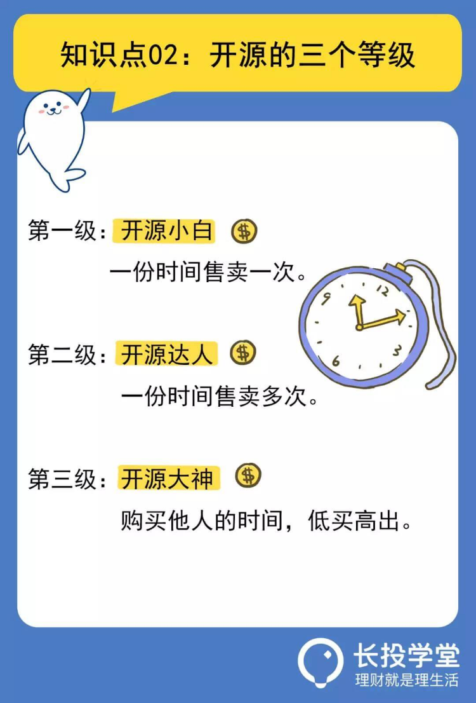

# 【第五课】本金不够多，开源来解决
理财就是理生活。欢迎来到长投学堂小白理财训练营。

## 开源养鹅法
之前的课程中我们了解了五类投资品，想要依靠投资赚钱，增加本金是必不可少的。增加本金是我们“养鹅”的过程，把鹅养得越肥，鹅下的蛋才会越多。而本金的来源主要是通过开源赚钱，增加主动收入。    

  

我们可以把这种方法称为“开源养鹅法”，就是先开源赚取主动收入，然后把这笔钱作为投资的本金，从而可以赚取被动收入。    
开源可以解释为增加赚钱的渠道。如果把我们的财富比作一个蓄水池，开源就是增加多个进水口。

  

听起来不难理解，但实际上，很多人对开源的认识还停留在原始阶段，他们认为，开源无非就是多干一份活呗，一份工作就已经累死累活了，哪有时间再多做一份工作，就算有时间也没体力了。

停，拥有以上想法的人，其实是不了解，开源也是分等级的。大部分穷人都在拼时间赚钱，所以他们一想到开源，第一反应就是拼时间。
相反，富人们想的永远不是拼时间，而是把单位时间发挥出最大的价值。
打个比方，同样是一天工作8小时，每小时赚20块钱。穷人考虑的是加时间，把8小时改到18小时，这样虽然能多赚，但是一天24小时永远不变，能赚的钱也始终有限。富人考虑的是加时薪，把每小时赚20改到每小时赚200，甚至更多，只要能力强，赚钱根本上不封顶。
开源也是同样的道理，聪明人开源，利用的不是时间长度，而是时间价值。  

  

## 开源的三个等级
具体来看，开源共分为三个等级：    

> 第一级，开源小白，一份时间售卖一次。    

话说，翠花业余开了家美甲店赚点外快，他每做一次美甲，就获得一份收入，如果不做就赚不到钱。

这就是开源小白的做法，一份时间售卖一次，想要赚多份钱，就得花费多份时间，多做几次美甲。

> 第二级，开源达人，一份时间售卖多次。    

翠花发现美甲店赚钱效率太低，她索性把做美甲的方法写成文章，配上图片，作为付费教程放到了网上；这就积累了一批忠实的付费粉丝。
翠花写一次美甲教程只用一份时间，却可以获得多人付费，这就是开源达人的做法，一份时间售卖多次

> 第三级，开源大神，购买他人的时间，低买高出。

后来，翠花发现凭借一个人写教程，还是十分花费精力，而且文章更新的速度太慢了，满足不了粉丝们的需求。
于是，翠花雇了三个美甲爱好者帮她更新美甲教程，而她只需要做一下审核的工作就可以了。
这就是开源大神的做法，购买他人的时间，低买高出。

  

通过翠花一路升级的过程，我们了解了开源的三个等级，回头再看穷人的生活就会发现，搬砖其实是一份时间只售卖一次，属于最低级别的开源小白。
那么问题来了：对于广大无产阶级老百姓来说，怎么才能把一份时间售卖多次，或者购买他人的时间来为自己赚钱呢？

  

## 做一个开源达人
购买他人的时间需要一定的本钱，而且还要对他人的劳动负责，做起来难度相对较高；但是，咱们就算做不到开源大神，做个开源达人也能甩别人八条街了。
要把一份时间售卖多次，有个门槛特别低、效率特别高的方法，那就是利用互联网，发布自己的作品。 

     

再说得清楚一点，就是将自己的知识、经验或者技能，以文字、音频、视频或者直播的形式放到网上，吸引流量。   
比如，有人特别擅长小学数学，就在网上讲解一些典型的数学题；有人精通健身和瑜伽，就在网上教大家减肥塑形的方法；还有人是画画高手，就在网上教大家零基础学画画……
只要你有才能，互联网就是一个变现的平台；流量积累充足以后，你每产出一篇文章或者一个视频，就会得到多份付费或者打赏。
有人会问：像我这种唱也不会唱，跳也不会跳，写也不会写的人，除了身边的柴米油盐酱醋茶，几乎没什么过人之处，我能发布什么作品呢？
如果你的生活就是柴米油盐酱醋茶，那就可以把你的一些生活小妙招写成文章，或者录成视频，比如怎么才能轻松去除厨房的油污，怎么擦玻璃更干净等等。
如果你的生活就是带娃，那就可以把你带娃的一些经验发到网上，比如怎样挑选性价比高的尿不湿，多久带娃去游泳一次等等。

  

如果你是个段子手，那就开个直播讲段子，或者录成幽默视频定期更新也可以。
如果你啥都不会，就会吃，那也可以说是非常优秀了。那就把你会吃的一面展现出来，很多人在网上发布试吃的视频，起个专业的名字叫“食物测评”，浏览量都能过万。
他们可以，你也一定可以。互联网上从来不缺少和你的生活场景相似的人，只要你建立了开源的思维，多重收入从来不是什么难事。

  

除了今天课程介绍的开源方法，还有很多简单可执行的方法，比如利用人脉赚钱，利用自己的朋友圈赚钱，卖出和别人不一样的产品，等等。
世界上从来不缺钱，缺的是发现赚钱方法的眼睛。
想要打开更多的开源新方式，大家可以戳文末的课程推荐，试听长投学堂最新推出的课程：《开源赚钱课》。

## 敲黑板划重点
好了，今天的课程就到这里了。下面我们来总结一下：

* 第一，开源“养鹅”法，就是先开源赚取主动收入，然后把这笔钱作为投资的本金，从而可以赚取被动收入。

* 第二，开源共分为三个等级，第一级，开源小白，一份时间售卖一次；第二级，开源达人，一份时间售卖多次；第三级，开源大神，购买他人的时间，低买高出。

* 第三，如何将一份时间售卖多次？有个门槛低、效率高的方法，那就是将自己的知识、经验或者技能，以文字、音频、视频或者直播的形式放到网上，吸引流量。

本节课的最后还有课后作业，记得点击下方【写作业】完成哦，完成后可获得【作业成就卡】，快去检验你的学习效果吧。  

日拱一卒，积少成多，每天成长百分五，你也可以财务自由，我们下节课再见。

