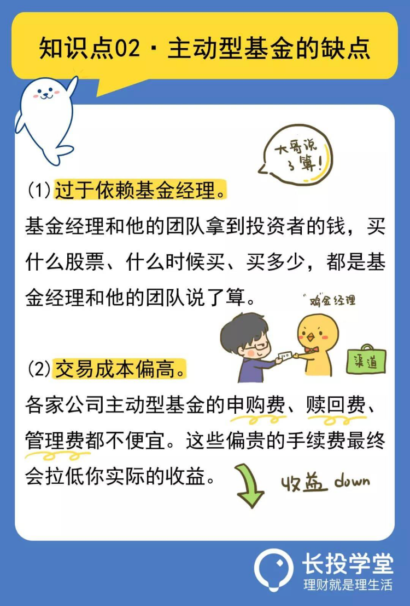
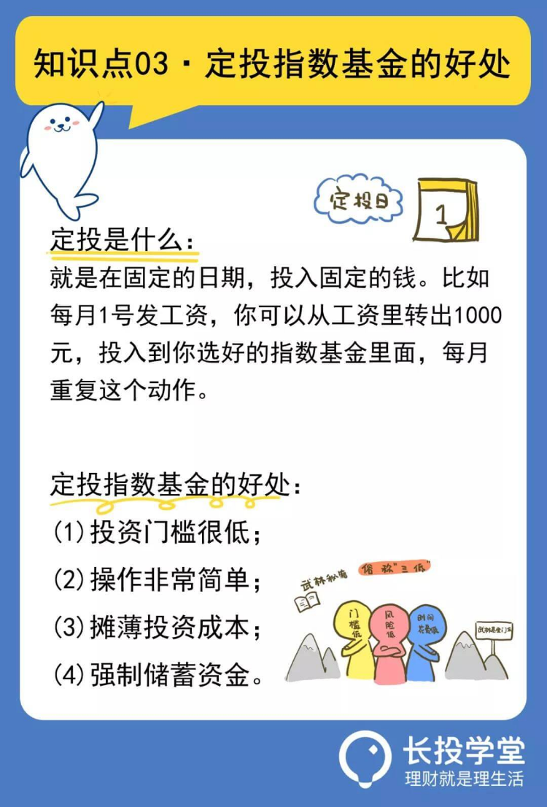

# 【第六课】买基金与买口红一样简单
理财就是理生活。欢迎来到长投学堂小白理财训练营。

今天我们一起来学习第六课：买基金和买口红一样简单。

## 口红与基金的奥秘
男生总是很难理解，女生的口红为什么那么多牌子，YSL、迪奥、阿玛尼、香奈儿等，颜色看起来根本没差别。
更令男生费解的是，女生还热衷拼团买口红。
    
限量版的口红套装，女生获得的路径一般是这样的。
方法一：让男朋友或者老公直接送。
方法二：召集两三个闺蜜，买回一套几个人分。
当然，送礼这种需要运气的方法，并不是每个女生特享的。
那我们就来聊聊方法二，2-3个关系好的女生，每个人花一点点钱，共同去买一个套装。
这种购买方式，其实就类似基金购买。
    
基金是什么？
举个例子，我很会投资，每年投资都赚钱，朋友们钦佩我的能力，嚷嚷着把钱给我，让我去帮他们投资赚钱。
于是，5万，10万这些小金额，最后凑齐了200万。我拿这200万去做专业的投资。
你投了钱，持有这些200万中的一部分，这就是基金。
基金，就是基金公司收集投资者的钱，按照证监会规定的规则，进行各种各样的投资的一种投资品。    
一般情况下，各种渠道，比如银行、基金公司以及第三方平台等，购买的基金都会受到严格监管，基金经理只能用这些钱来投资，是没法直接接触到这些钱的。
所以说，我们的钱是相对安全的。

    
## 基金经理：你出钱，我出力
根据投资理念的不同，基金可以分为主动型基金和被动型基金。    
主动型基金就是基金经理拿了我们的钱来替我们投资，投资哪家的股票、哪家的债券，都是由基金经理说了算。
主动出击，寻求超越平均水准的超值回报。
这里，你需要知道主动型基金中，两个值得注意的问题：  

第一是，过于依赖基金经理。 

   
    
这是由主动型基金的运作方式决定的。基金经理和他的团队拿到投资者的钱，买什么股票、什么时候买、买多少，都是基金经理和他的团队说了算。
如果你眼光好，在市场中上千只股票基金中选择了一个牛逼的基金经理，恭喜你，他能帮你跑赢市场，获得超额收益。
但这件事情没有想象的那么容易，从历史数据看，能够长期跑赢市场的基金经理是很少的。

第二是，交易成本偏高。    

    
基金经理和团队这么辛苦帮你投资，没有功劳也有苦劳，付点钱给人家也是理所应当的。
所以，各家公司主动型基金的申购费、赎回费、管理费都不便宜。这些偏贵的手续费最终会拉低你实际的收益。
综上，想要挑选出一只高收益、靠谱的主动型基金，不容易！

    
## 股神的最爱——指数型基金
说完主动型基金，我们来讲被动型基金。被动型基金，又叫指数基金。    
说到指数基金，就不得不说到股神巴菲特。

    
在1965～2006年的42年间，他老人家管理的投资公司——伯克希尔，平均每年净资产增长21.46%。
每年20%+的增长，你可能没什么概念，听过之后转头就忘掉了。
我们假设一下，你现在拿着10万元跟着股神投资，那么42年后，你的总资产将会超过3.5亿。
股神之所以称之为股神，就是因为他通过投资赚取了普通人难以想象到的收益。
然而这位股神，曾经立下过遗嘱，白纸黑字写明了：自己去世之后，请家人把他90%的资产，用于投资指数基金。
是的，你没有听错，90%的资产，不是可口可乐，不是麦当劳，而是指数基金。
巴菲特在2008年发起一个10年赌约，赌注是50万：10年后，标普500指数基金，能打赢任何的主动性股票基金组合。
当时，只有一个基金经理应战。2018年，10年赌约截止，标普500平均涨85%，而跟他对赌的经理人选的组合，只涨了22%。
巴菲特曾说：通过定期投资指数基金，一个什么都不懂的业余投资者，都能够战胜大部分投资专家。    
    
于是我有了偷懒的想法：巴菲特是股神，他的投资肯定错不了，我干脆学他的投资好了。
他投资什么，我就跟着投资什么，他赚钱了，我就也就赚钱了。当然了，如果他亏钱，我也是要跟着亏钱。不过我相信股神不会亏的。
这就是指数基金的原理。指数基金，就是基金经理不主动寻求超越市场的表现，复制别人的整个投资，不需要你自己花太多精力来做选择。   
    
## 十分钟操作——基金定投
指数基金，只要你手头有100元，就都能开始投资；你跟着一个策略走，以不变应万变。
每个月定投也就花不到10分钟的时间，长期下来，就可以获得和股神相似的收益，简直上班族、没钱党的必备投资技能，没有之一。
定投是什么呢？就是在固定的日期，投入固定的钱。    
举个例子，每月1号公司发你工资，这天你就从工资里转出1000元，投入到你选好的指数基金里面。每月重复这个动作。

    
每月定投比直接一次投资是有非常多的好处的。
首先，投资门槛很低，每月拿出100块，比一次性拿出2万简单得多；
其次，操作非常简单，每月固定时间投一笔钱到选中的基金，不需花很长的时间分析公司；
除此之外，还可以摊薄投资成本，指数基金的价格是波动的，你不能确定这次买是不是最便宜的，分开每月买一次就平均了；
最后，定投还可以当成强制储蓄资金，每月把钱转到基金账户，还不会脑子一发热就把钱花掉了。
在投资中，我们是无法精确找出一只指数基金，价格最低，以后涨幅最高，但是却能通过策略，找到相对低价的好基金。
虽然从理论上讲，长期投资指数基金都能赚钱，但是有策略的收益会高出2倍，甚至更高。
说到这里，有的同学心里还是会很多疑惑：
你说了那么多，但实际市场上基金品种还是有很多，我要怎么找到最适合自己的基金呢？你说的高效赚钱的定投策略到底是什么呢？
    
诶，别着急，基金投资策略种类繁多，如果我们想要找到真正合适自己的一项基金，需要投入一定的时间和精力。
所以在长投学堂的《基金初级训练营》中我们用深入浅出的方式解答了同学们的疑惑，让我们能够系统地学习基金知识和策略。
同学们也可以戳文末的课程推荐，进行试听。

 

## 敲黑板划重点
现在，我们来总结一下本课的知识点：

* 1，基金，就是基金公司收集投资者的钱，按照证监会规定的规则，进行各种各样的投资的一种投资品。

* 2，根据投资理念的不同，基金可以分为主动型基金和被动型基金。

* 3，主动型基金的两个缺点是，过于依赖基金经理，交易成本偏高。

* 4，基金定投的好处是，投资门槛很低；操作非常简单；摊薄投资成本；强制储蓄资金。

本节课的最后还有课后作业，记得点击下方【写作业】完成哦，完成后可获得【作业成就卡】，快去检验你的学习效果吧。 
   
今天的内容就到这里啦。日拱一卒，积少成多，每天成长百分五，你也可以财务自由，我们下节课再见。

