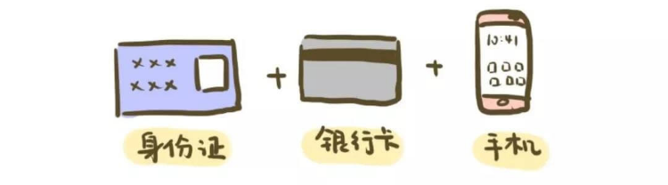

# 【第八课】每年白捡几百块，要不要
理财就是理生活。欢迎来到长投学堂小白理财训练营。

今天我们一起来学习第八课：每年白捡几百块，要不要？ 

## 国债逆回购
多数人有这么一大特点：爱装逼。人人都能听懂的东西，撑不起面子，就不叫高逼格。

举个例子，有一次我去一个饭店吃饭，饭店大厅金碧辉煌，金光闪闪，心里那点虚荣心立马就膨胀，简直要爆炸。

于是，为了满足自己的虚荣心，点了一份“荷兰黑椒牛肉风味浓汤”，报价98元，端上来却发现是一碗胡辣汤，而小区门口的早餐店不过5块钱。

在中国，菜名可以复杂，越复杂越能激起欲望去购买；但诸多投资产品听起来却很简单，因为越简单越能让不懂的人去送钱。
穷人，就是这样一点点练成的。
如果我告诉你，有一个投资品，操作简单，风险很低，基本是稳赚不赔。它的名字叫做，国债逆回购。
我猜你第一反应是：又想骗我钱！然后潇洒转身，不带走一片云彩。
你能这么想，说明认真学习了课程，不懂的知识不要碰，很重要。
实际上，国债逆回购就像甘甜的橙子，剥开皮就可以尝到美味。

想要说清楚这个投资品，我们可以从一个简单的故事开始。
在初三语文课本的课外读物中，有一个小剧场，叫做白毛女，不知道你现在还记得多少，我们来简单回顾一下剧情。
这场剧里共有三个主要人物：地主黄世仁，农民杨白劳，和杨白劳的女儿喜儿。
黄世仁是一个地主土豪，杨白劳是一个农民屌丝。年初的时候，杨白劳问黄世仁借了好多箱方便面，然后吧唧吧唧吃完了。
年末的时候黄世仁要他还，杨白劳两手一摊：“我没钱，方便面也吃完了，只有穷命一条，你看着办吧。”
黄世仁邪魅一笑：“你借方便面时，把你家丫头喜儿做为抵押物，现在还不上方便面，那就拿喜儿抵债吧。”

这就是一个虚构的故事，那时候肯定没有方便面。
把故事中的主人公，杨白劳换成金融机构，债主黄世仁换成你，喜儿换成抵押物国债，就是国债逆回购。
国债逆回购就是金融机构把国债抵押给你，找你借钱。

## 稳赚不赔的奥秘
国债是中央政府的借据，因为有国家背书，安全性很高。企业、银行以及各类大机构，都会购买一定比例的国债，作为比较保守的投资。

企业以及机构在经营过程中，有时会缺少流动资金，就会把国债抵押用来周转资金。
举个例子，一家五星级酒店，董事长认为今年的雾霾挺严重的，打算装一套空气净化系统，这时就需要一笔周转资金。
他没有考虑银行贷款，因为周期很长。
最后他把买的国债当做抵押物，借了一笔周转的资金来购买空气净化器。酒店每天都有客人的房费收入，周转起来还蛮方便的。
企业以国债为抵押物借钱，我们借钱给他们，就算到期还不上钱，手里也有国债。所以，把国债逆回购说成是稳赚不赔，一点也不过分。

## 操作三步走
国债逆回购的具体操作有三步。

### 第一步，开通账户。
想要操作国债逆回购，首先你得有个股票账户，股票账户不仅可以买卖股票，还可以买债券、基金、国债逆回购等投资品。
开户很简单，身份证、银行卡和手机，按照网上的开户流程，10分钟就搞定了。

好的证券公司，总结为9个字：服务好、网点多、佣金低。
服务好的公司，会给你良好的用户体验。
大一些的券商网点多，有些业务必须去柜台办理，比如打印交易流水，没网点不方便。交易佣金是以后每一次交易都要付的，越低越好。
另外，下载开户券商APP一定去官方网站，小心木马中毒，毕竟投资是涉及真金白银的。

### 第二步，跨过门槛。
上海证券交易所（上交所）的门槛高一些，如果你要进行国债逆回购，至少要有10W元的流动资金。
深圳证券交易所（深交所）低个档次，1000元就可以参与了。刚开始我们就可以选择门槛低的深交所交易。
逆回购有1天、7天、14天，甚至是182天的，具体的天数也体现在代码上。
对照原文，你就可看到所有的逆回购代码。

### 第三步，卖出份额。
首先，登录软件。查找131810，也就是1天期的国债逆回购，进入对应页面，点击“卖出”按钮。
国债逆回购“卖出”这个操作就相当于我们把自己的钱以一个合理的价格给“卖”出去。

然后，确定下单。
如果要确保成交，我们卖出的价格要跟“买一”的价格一样，这个“买一”的价格就是你下单的利率。
数字越高，你得到的利息越高。不过，这个利息是没办法无限高的。

一般星期四、月末、季度末、年末，市场资金面紧张时，利息通常会变得很高。
最后，查看是否申请成功。
申请了之后，可以再点击一下委托，看一下是不是真的申购成功了，标注为“已成”，就代表申购成功。如果没有成功，撤销重新再操作一遍。
另外，国债逆回购到期后，资金就会自动流到我们的账户里，不用再像股票基金一样，买入后还要手动卖出，真的是超级省心。

## 敲黑板划重点啦
好啦，本课的内容到这里就结束啦，这几天学习了很多的投资品，是不是觉得已经学富五车，可以凭借投资跻身富豪榜了？

这种想法真的就危险了，变富如果那么容易，世上怎么还有这么多穷人？

投资不是一夜暴富的事，想要学好投资，说长远一点，甚至是一辈子的修行

我见过许多富人，也听过他们的故事，尽管各有各的变富方式。

但都有一个共同点：在投资的道路不断摸索，朝着有光的地方匍匐前行，每日一步，终至千里。

本节课的最后还有课后作业，记得点击下方【写作业】完成哦，完成后可获得【作业成就卡】，快去检验你的学习效果吧。

今天的内容就到这里啦。日拱一卒，积少成多，每天成长百分五，你也可以财务自由。我们下节课再见。

