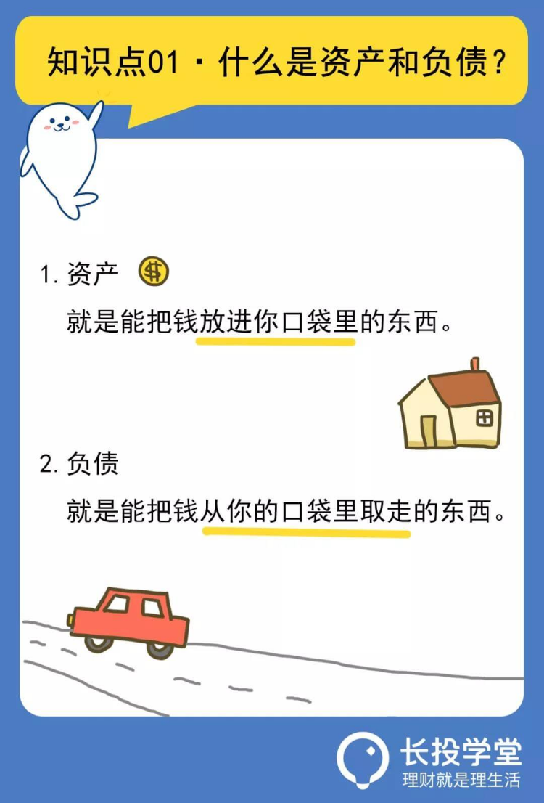

# 【第拐课】清点资产，也许你是一个隐形富豪
理财就是理生活。欢迎来到长投学堂小白理财训练营。

名车豪宅，是资产吗?

首先问大家一个问题，假如你有个亲戚突然暴富，送了你一辆458系列的法拉利跑车，而且还是那种不收就断绝亲戚关系的白送，这辆法拉利是你的资产还是负债呢？

你可能会想，法拉利啊，还是我最喜欢的458系列，这兑成现金都能值400多万了，出去溜一圈装×值瞬间满格啊！
不用掏钱就能来一辆，当然是资产啊。想象一下，夕阳西下，你拖着喜欢的小妹妹的手，开着法拉利奔驰在环海公路上，美哉美哉……

停停停，现在可不是白日做梦的时候，如果我告诉你养一辆法拉利得多少钱，你还笑的出来么？
别的不说，光法拉利的购置税就得38万，更别提给车上保险或者上牌照了，这些大大小小需要花钱的地方加起来就至少得50万。

有的小伙伴可能会说了，吃得起100块一只的螃蟹，难道连5块钱一瓶的山西老陈醋都舍不得买?比起400万的车钱，这50万算得了啥？

如果我告诉你还有维修和保养的钱呢？之前论坛上说，搞坏了一个减速带，据说维修费就要6位数……

别怪我不仁义，打碎大家白日做梦的梦想，其实我真正想告诉大家的是，一个减速带都可以怼掉你半年收入了，而且即使不出故障，像你这样的普通人，开辆法拉利，除了能给你带来点虚荣心以外并不能给你带来收入。
相反，你还要为它大把大把的撒钱。所以，法拉利对你来说，不是资产，而是负债。

同理还有我们自住的房子，表面上我们是有了一套自己的房子，但买来后，我们还要为它付税，还贷，装修等等，有的小区还得交物业费。

这些都需要不断地花钱。除非你有意将房子卖掉或者出租收租金，不然房子真的不能算是你的资产。

## 资产和负债如何区分
那么，到底应该如何区分资产和负债呢？

《富爸爸穷爸爸》一书中，对资产和负债的定义是：资产，就是能把钱放进你口袋里的东西；负债，就是把钱从你的口袋里取走的东西。

啥能给你赚钱呢？股票、基金、可以收租金的房子！啥东西烧钱呢？自用的车子、需要定期维护保养的包包（不能转卖），等等。
如果有会计和金融专业的小伙伴可能会对资产和负债有更书面化的理解哈，但仔细想想资产和负债的本质其实就是这样的，想要深入了解的小伙伴，可以自己课后自行研究哦~
经上面这么一说，小伙伴们是不是自动开启反省模式了？原以为是资产的东西没想到大部分都是负债！
有的小伙伴还仗着自己“有车有房”任性地开始了毫无拘束的买买买生活，殊不知自己已经“债台高筑”了，当然这个词是夸张的说法啦，不过不能任性购物倒是真的。

很多人在购物时都会有类似的困惑：我并没有买什么乱七八糟的东西呀，怎么每个月的花销这么大？逛个超市买的都是生活必需品呀，怎么每次去都得花大几百！

这其中还不乏那些知道记账的“优良学生”，虽然账是记住了，但回头看看自己一年的开销，还是控制不住自己大手大脚的花钱。

这其中的根本原因就在于没有分清楚什么是“必要”，什么是“需要”，什么是“想要”。

## 分清“必要”“需要”和“想要”
我们先来谈谈“必要”，必要，是维持基本生活所需的东西，是你不花会死的。

比如，你不喝水会死，不付房租也算是会死，毕竟你总不能睡大街吧。衣食住行，这些都是包含在必要里面的。
需要，就是可以在必要之上，稍微改善生活质量的，是在必要基础上更进一步的满足。 比如，喝牛奶，补充一些营养呀！或者，每天吃个水果，补充一下维生素，防止便秘呀，等等。
不过也有的人分不清必要和需要，总觉得这个也必要，那个也必要。
其实你可以从这个思路去想：寒冬腊月，我穿件棉袄就可以保暖御寒，但是我还买了件加绒加厚的保暖内衣，棉袄就是必要，加绒加厚的保暖内衣就是需要！
我吃一个馒头可以饱腹，但是我去吃了碗面。馒头就是必要，面就是需要！
我住个单间足够安身，但是我却住了个一室一厅带独立厨卫的套房。单间就是必要，一室一厅带独立厨卫的套房就是需要！

需要，是在必要基础上更进一步的满足。
而想要呢，其实就是欲望的写照。
比如我有了棉袄，也有保暖内衣，我还想要一个纯羊绒的呢子大衣，这个穿上去更修身，更漂亮！呢子大衣就是想要！
我不想吃馒头，也不想吃面，我只想去吃一顿豪华大餐！豪华大餐就是想要。
我嫌弃单间太过狭小，一室一厅带独立厨卫的套间位置不好，最后挑了个高级公寓里带精装修的两室一厅，另外一个房间正好可以用来做书房，带精装修的高级公寓就是想要。

有的小伙伴可能会嚷嚷了：哎呀！照你这么一说，我花在“想要”上的钱是最多的，可是我克制不住呀，我的购物行为都是想一出是一出的……
没关系，刚开始都是这样的，我传你两个绝招。
* 第一个绝招：开始记账，或者再懒的话，可以直接翻翻你的支付宝消费账单，把那些买完用不上的东西都圈出来，避免下次再买。
* 第二：要是实在搞不清你的需求和欲望。再送你个简单粗暴的口诀，买东西之前扪心自问：

	①这个不买会死吗?

	②以后买会死吗？

	③买个便宜的会死吗?

虽然感觉打开钱包和支付码的瞬间好像要进入了生死抉择。但对许多剁手党来说，你不让他们买，就好像是要他们的命一样啊！一旦你开始控制，你就会形成习惯，渐渐地你会发现，赚钱可比花钱有趣多啦！

##敲黑板划重点啦
今天的课程就到这里了，下面我们来总结一下：

* 一.资产和负债的定义，资产，就是能把钱放进你口袋里的东西；负债，就是把钱从你的口袋里取走的东西。

* 二.分清楚“必要”“需要”和“想要”。
“必要”是维持基本生活所需的东西，是你不花会死的；
“需要”是可以在必要基础上进一步改善生活质量的。
“想要”是我们欲望的写照。

* 三.买东西之前扪心自问：
	- ①这个不买会死吗?
	- ②以后买会死吗？
	- ③买个便宜的会死吗?

本节课的最后还有课后作业，记得点击下方【写作业】完成哦，完成后可获得【作业成就卡】，快去检验你的学习效果吧。

日拱一卒，积少成多，每天成长百分五，你也可以财务自由，我们下节课再见。

