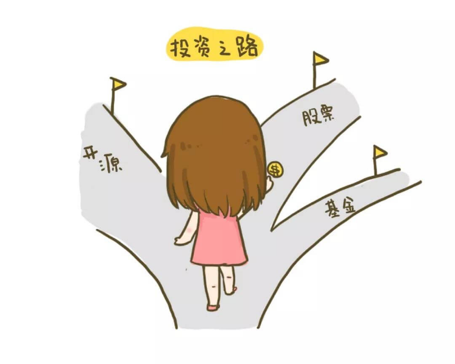

# 【第九课】人生三大投资，你投对了几个
理财就是理生活。欢迎来到长投学堂小白理财训练营。

今天我们来学习最后一课：人生三大投资，你投对了几个？ 

通过前几课的学习，我们已经知道，投资能够帮我们跑赢通货膨胀，带给我们不菲的收益。而且，我们也学习了各种投资品赚钱的逻辑。

既然投资有这么大的好处，而且每个普通人都可以操作，那就应该长期坚持下去。投资不是赌运气，不是赚快钱，不是捞一笔就跑，它是我们一辈子的修行。
如果我们把眼光放长远一些，就会发现，投资不仅仅是赚钱那么简单，它对我们整个一生而言，蕴藏着更大的价值。每个人的一生都应该做到三大投资：投资金钱、投资时间和投资自己。

## 投资金钱
首先是投资金钱。 这是成为富人的重要通道，穷人把辛苦劳动作为他们唯一能做的事，一辈子拿着主动收入，不知道利用复利的威力，让钱生钱，所以从来没有被动收入。
我们经常听到一个词叫做“财务自由”。怎样才算财务自由呢？
其实就是通过被动收入判断的，当一个人的被动收入可以满足他日常生活的所有支出，不用花费主动收入的时候，他就实现了财务自由。

换句话说，一个人单靠投资赚的钱就能养活自己的时候，他就实现了财务自由。
所以，人生的第一大投资就是投资金钱，通过钱生钱，让我们早日实现财务自由。

## 投资时间
其次是投资时间。时间是这个世界上最公平的东西，无论是富到流油、人人都想嫁给她的马云，还是街边乞讨、食不果腹的流浪汉，我们每个人每天都是24小时，谁也不会多，谁也不会少。

所以说，我们应该做的不是创造更多的时间，因为这是不可能的，谁也不可能得到第25小时；我们应该做的是，充分发挥现有时间的价值。
同样是一个小时，马云可以收入过亿，流浪汉可能颗粒无收。我们拿每天的24小时做什么，就是我们的投资。
穷人不懂得投资时间，只知道去拼工作的时间长度，然而时间长度永远是有限的；富人拼的不是时间长度，而是单位时间的价值，因为时间的价值可以是无限的。

## 投资自己
最后，也是最重要的，是投资自己。投资股票可能会亏损，但是投资自己永远不会。
投资自己其实很简单，比如你从30岁就开始不断做护肤和防晒，到50岁的时候，同龄人已经遍布眼袋皱纹，而你还可以皮肤紧致，面色红润，这就是在投资自己，投资的对象是你的颜值。

比投资外在更重要的，是投资自己的内在。通过学习，让自己拥有更开放的思维，更丰富的知识；通过建立能力圈，让自己拥有更广阔的人脉，更开阔的眼界。
这就是人生的三大投资，投资金钱，投资时间，投资自己。那么，有没有什么办法，能让我们一键搞定这三大投资呢？
当然有——
如果我们把自己的时间拿来学习如何赚钱，那就可以一次性集齐三大投资了。
长投学堂调研了市面上大部分学员的需求，开发了适合小白学习的三门初级课，帮你打好基础知识，手把手教你怎么赚钱，不仅增加你的主动收入，同时增加你的被动收入，让你离财富自由不再遥远。

## 开源赚钱课
要想鹅下蛋，先把鹅养肥。在我们建立的收入体系中，投资的本金主要来自我们的主动收入。
主动收入哪里来，光靠死工资可不行。每天30分钟，14天摆脱死工资，这门课的目的就是教你花式赚钱，养一只白白胖胖的鹅，对本金不多的同学来说特别实用。
课程拒绝高深莫测的理论，拒绝只好听不实用的鸡汤；提供给大家30多种开源赚钱的思路，从凭借技能、兴趣赚钱，到职场加薪，再到自己做生意，每种都贴近普通人的现实生活，总有一款适合你。
学完就可以上手操作，从此告别单一收入。

## 基金初级训练营
家有大白鹅，得让它下蛋。手里拿着钱，投点什么好呢？作为风险适中、收益可观的投资品，基金绝对是大众友好型的选择。
基金初级训练营拥有幽默诙谐的课程内容，让你轻松学习基金知识的干货，学会投资基金的策略，帮你轻松解决基金定投中的核心问题。
班班手把手带你找到值得定投的指数基金，以及定投方法，获得一份合理收益。

## 股票初级训练营
俗话说得好，不能把鸡蛋放在一个篮子里，投资多种投资品，可以分散我们的投资风险。
除了基金之外，股票也是不错的选择。股票初级训练营，教你3步找准入市姿势，班班手把手带你看懂上市公司，构建自己的投资组合，让好公司为你挣钱。
此外还有2个适合新手的投资策略，以及干货满满的股票初级知识。
别看名字里带着“初级”两个字，课程内容也是实践结合理论，手把手带你实操的哟。精心打造适合新手的投资策略，只要坚持下去，收益也是棒棒哒！

## 敲黑板划重点啦
好啦！感谢你听到这里，小白营的课程到此就告一段落了，以后的路，长投学堂也会陪伴你一直走下去。

今天课程的重点也很简单，希望大家记住人生的三大投资：投资金钱、投资时间，以及最最重要的投资自己。
这三个锦囊，在你未来的人生路上，会让你受益终生哦！

最后，如果你对长投学堂的三门初级课感兴趣，小白营有专属福利，班班手里有少量的课程优惠码，去私聊班班吧。

当然喽，如果你对后续目标还没有规划，也可以私聊班班帮你规划一下哦！

本节课的最后还有课后作业，记得点击下方【写作业】完成哦，完成后可获得【作业成就卡】，快去检验你的学习效果吧。

恭喜你完成了小白理财训练营的最后一课。日拱一卒，积少成多，每天成长百分五，你也可以实现财务自由。
就让我们掸掸身上的灰尘，再次踏上征程吧。

同学们，再见啦！

